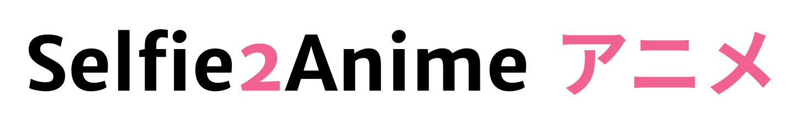

 

&nbsp;
&nbsp;

# Selfie2Anime

*What do YOU look like in ANIME?*

This repository contains the source code for the [selfie2anime.com](https://selfie2anime.com) website. Upload a selfie and find out what you look like as an anime character!

# How Does it Work?

Using machine learning techniques combined with a [Generative Adversarial Network (GAN)](https://en.wikipedia.org/wiki/Generative_adversarial_network) makes it possible to generate anime-style characters based on real people. With this website, you can generate your own anime alter ego!

The GAN we are using is based on original work by *Junho Kim*, *Minjae Kim*, *Hyeonwoo Kang*, and *Kwanghee Lee*. More information can be found in their awesome repository, which is [available here](https://github.com/taki0112/UGATIT), or in [their research paper](https://arxiv.org/abs/1907.10830).

# Sample Photos

Recent anime selfies are being published on Twitter [@RicoBeti](https://twitter.com/RicoBeti).

### Here is a bunch of images that have been generated...

### ...and here are some of Australia's Prime Ministers

## License

MIT, see [LICENSE.txt](LICENSE.txt).

